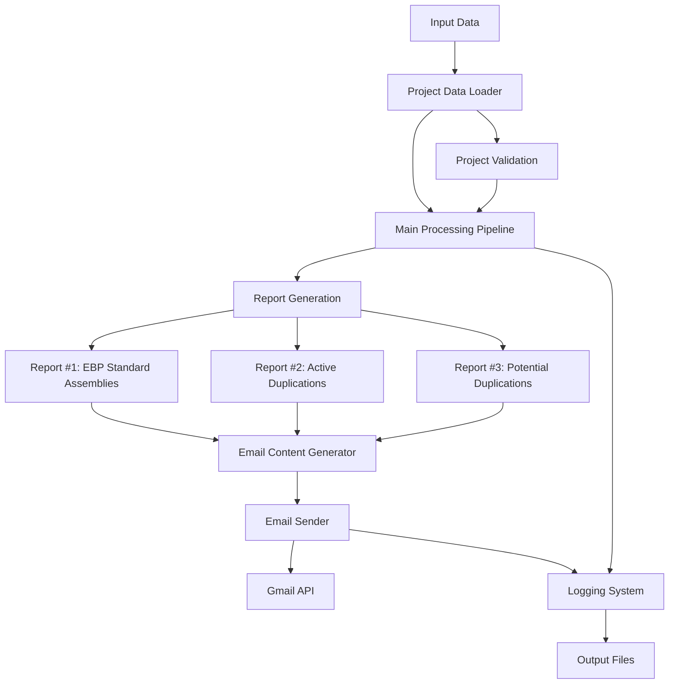

# Notification System Framework

This document contains the Mermaid diagram showing the framework of the notification system.

## System Overview

The notification system processes project data from GoaT (Genome of All Types) database, generates reports, and sends email notifications to project contacts.

## Component Descriptions

1. **Input Data**
   - `GoaT-Projects-Copy.tsv`: Contains project information
   - Project contacts spreadsheet
   - GoaT API endpoints

2. **Project Data Loader**
   - Loads project information from TSV file
   - Validates project data
   - Handles project contact information

3. **Main Processing Pipeline**
   - Orchestrates the entire notification process
   - Manages project validation
   - Coordinates report generation and email sending

4. **Report Generation**
   - Three types of reports:
     - Report #1: Species with EBP-standard assemblies
     - Report #2: Active duplications with non-standard assemblies
     - Report #3: Potential duplications with non-standard assemblies
   - Each report includes:
     - Status tables
     - GoaT report URLs
     - Recommendations

5. **Email Content Generator**
   - Creates HTML email content
   - Formats status tables
   - Includes report links and recommendations

6. **Email Sender**
   - Uses Gmail API
   - Handles email delivery
   - Manages recipient lists

7. **Logging System**
   - Tracks processing status
   - Records successes and failures
   - Generates summary reports

8. **Output Files**
   - Log files with processing details
   - Summary reports
   - Error tracking

## System Workflow

1. Load and validate project data
2. For each project:
   - Generate three types of reports
   - Create email content
   - Send notification
   - Log results
3. Generate final summary report 